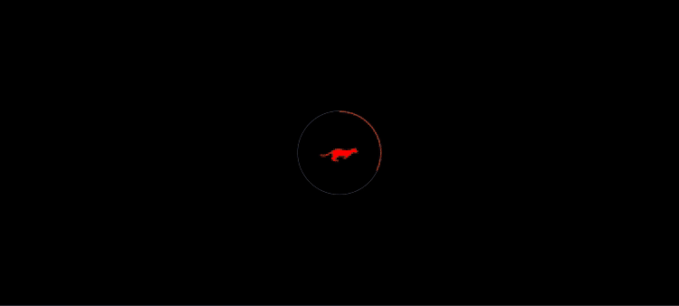

# Animation Practice with GSAP

A practice project exploring GSAP animations, featuring loading and text effects.

## Design

- Inspired by [Dogstudio's Cases page](https://dogstudio.co/cases/)

## Features

- Loading Animation
- Text Animation Effects
  - Letter-by-letter reveal
  - Team Taiwan text animation sequence

## Technologies Used

- HTML5
- CSS3
- JavaScript
- [GSAP](https://greensock.com/gsap/)

## Learning Focus

- GSAP Timeline implementation
- Text animation techniquess
- Loading animation design
- CSS class-based animations

## Getting Started

1. Clone this repository
2. Open with Live Server or directly open index.html
3. Watch the animations in action

## Preview

[🔗 Demo Page](https://momi329.github.io/polish-animation/)

